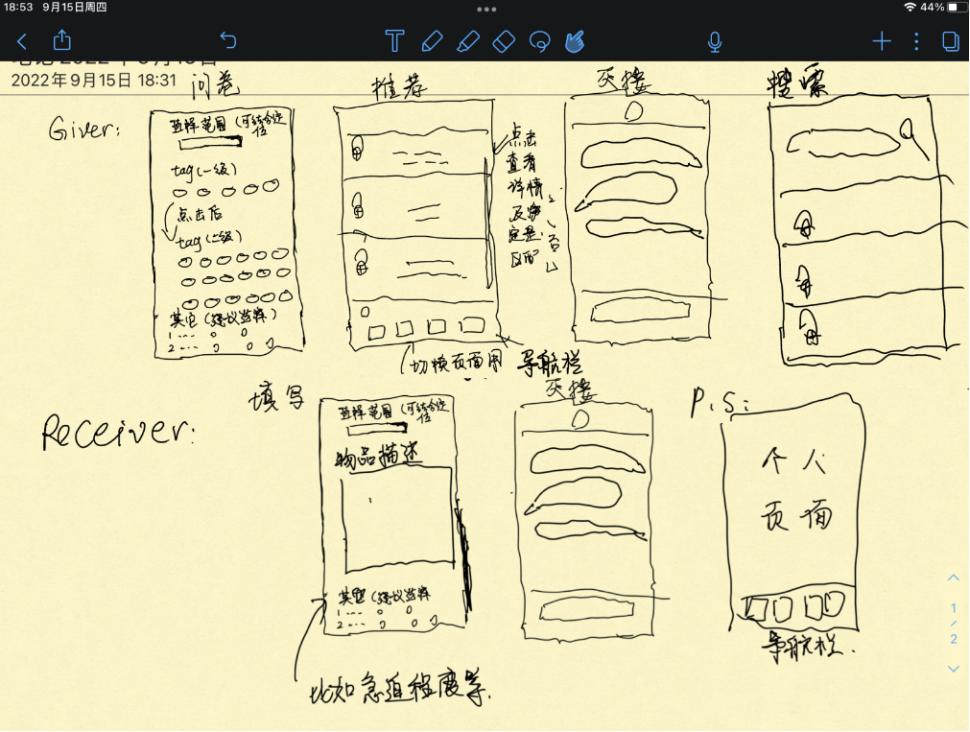
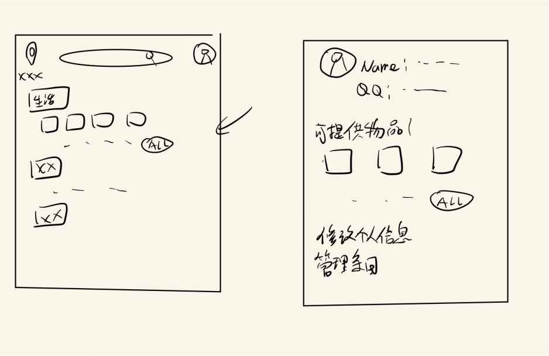

## 背景设定：
疫情期间，封闭管理的区域中的住户常常出现医疗物资、生活物资（如口罩、电池、卫生巾等）匮乏而无处补充的情况。各小区、街道等常常通过线上互助文档的形式传播需求和供给消息以实现日用品的内部流通。但线上文档在多人访问时的卡顿、条目过多时人力线性查询的低效以及整体的混乱且缺乏管理手段也成为了严重的具体问题。
面对这一实际困境，我们希望能开发一个线上互助平台，统一管理需求方的需求内容，并通过整理、推送等形式提供给潜在的供应方，以增加疫情期间管控区域内部人民互助的效率。

## 基本要求：
1. 单点登录，连接Jaccount获取信息。
2. 每个用户有求助者和施助者两种身份。
    1. 求助者。可在主广场发布自己的求助信息 带标题 可带详细需求介绍 并将自己的需求物品归类到某一TAG中 主广场中条目顺序由系统按照发布时间等综合排序 请求完全完成后系统删除 可随时修改
    2. 施助者。注册APP时填写自己较富余 可借出/赠与的物品 一并填写标签 并可在个人主页随时修改.
3.	通过平台随时向主广场中/推送用户发起私聊 确定物品交接细节
4.	可检索主广场内需求
5.	高并发。100个并发用户<3s

进阶要求：
1. 平台管理：
   - 对需求的发起进行管理：如同一用户最多发起的需求数目限制、对于长期悬置的需求进行周期性清空、对需求文本内容进行一定的审核。
   - 对私人聊天的管理：避免私信轰炸的基本措施——例如，同一用户同一时间仅能发起有限个私人聊天
   - 平台审核条目内容，对多次发表恶意信息的用户作封禁等处理

2. 推荐机制优化:设置多板块的优先推送机制，以确保需求可以尽可能全面地在推送流中被覆盖。设想以下栏目：
    - 按照紧急程度（悬置时间、需求自身属性）进行推送——展示最紧急或久未被满足的需求。
    - 按照用户登记的已有物资进行推送
    - 随机推送

3. 在推送、检索中使用语义搜索，实现较为智能的匹配关系。

4. 系统在进入APP时或每使用APP五分钟后（控制频率）向用户推送可能帮助到的对象 并可刷新

5. 积分功能。赠与行为获得积分，发布请求行为消耗积分。积分会影响个人物品的推送和主广场排序。初始积分支持5-10次求物贴，送出物品后可以获取5次发布求物贴的积分。高积分用户可赠送头像框等

6. 借助手机位置功能 通过设置区域来划定社群 同一社群内用户为一互助群体

7. 给予倾向调查：方式可以通过进入时的问卷，但问卷不宜太过繁琐，调查可以给予的物品时可以给出一些tag（tag可以细化），调查给予范围（设置地区，范围半径），性别（？），保留历史选择（下次进入时可以修改）

  

  
